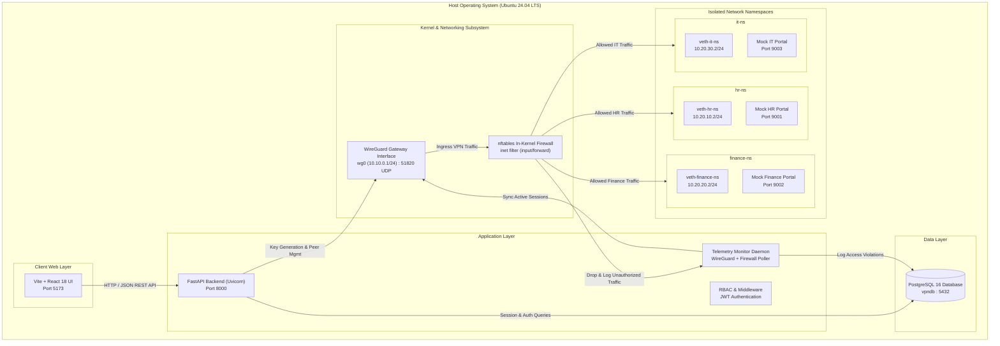

# System Architecture & Technical Specifications

## 1. High-Level Architecture Diagram

---

## 2. Micro-Segmentation Subnet & Port Allocations

| Micro-Segment | Namespace | Subnet CIDR | Portal IP & Port | Allowed Role | Isolation Policy |
|---|---|---|---|---|---|
| **VPN Overlay** | Root | `10.10.0.0/24` | `10.10.0.1:51820` | All authenticated | Client gateway |
| **Human Resources** | `hr-ns` | `10.20.10.0/24` | `10.20.10.2:9001` | HR, Admin | Drops cross-namespace and non-HR traffic |
| **Finance** | `finance-ns` | `10.20.20.0/24` | `10.20.20.2:9002` | Finance, Admin | Drops cross-namespace and non-Finance traffic |
| **IT Operations** | `it-ns` | `10.20.30.0/24` | `10.20.30.2:9003` | IT, Admin | Drops cross-namespace and non-IT traffic |

---

## 3. WireGuard Peer Cryptography & Allocation Policy
- **Key Generation:** Standard Curve25519 key pairs generated via `cryptography.hazmat.primitives.asymmetric.x25519`.
- **Key Storage:** Server public key is plaintext in the database; private key is encrypted at rest using AES-128-CBC / HMAC-SHA256 (Fernet) configured with `SECRET_KEY`.
- **IP Allocation:** Consecutive host IP assignment in `10.10.0.0/24` starting from `10.10.0.2` through `10.10.0.254`.
- **Client Configuration Generation:** Client configuration dynamically injects `AllowedIPs` tailored to the user's role:
  - HR User: `10.10.0.0/24, 10.20.10.0/24`
  - Finance User: `10.10.0.0/24, 10.20.20.0/24`
  - IT User: `10.10.0.0/24, 10.20.30.0/24`
  - Admin User: `10.10.0.0/24, 10.20.10.0/24, 10.20.20.0/24, 10.20.30.0/24`

---

## 4. Firewall Rule Model (`nftables`)
The `nftables` configuration is divided into:
- **`input` chain (policy: drop):** Permits SSH (22), WireGuard (51820/udp), Web UI and API (5173, 8000), loopback, and established connections. Drops and logs all other ingress traffic.
- **`forward` chain (policy: drop):**
  - Admins can forward packets to all micro-segments (`10.20.10.0/24`, `10.20.20.0/24`, `10.20.30.0/24`).
  - HR clients can forward packets ONLY to `10.20.10.0/24:9001`.
  - Finance clients can forward packets ONLY to `10.20.20.0/24:9002`.
  - IT clients can forward packets ONLY to `10.20.30.0/24:9003`.
  - Zero-Trust East-West rule (`ip saddr 10.20.0.0/16 ip daddr 10.20.0.0/16 counter drop`) prohibits lateral movement between departments.
  - Logging rule `counter log prefix "[NFT-FWD-DROP] " drop` records every unauthorized packet.
- **`postrouting` chain (NAT):** Masquerades outgoing traffic from `10.10.0.0/24` and `10.20.0.0/16`.

---

## 5. Security & Audit Logging Engine
The system maintains 2 levels of audit trails:
1. **Audit Logs (`audit_logs` table):**
   - User authentication success/failure.
   - Account lockout events (after 5 failed attempts).
   - User creation, update, activation, deactivation, deletion.
   - Role modifications.
2. **Access Violation Logs (`access_violations` table):**
   - Blocked lateral movement or unauthorized micro-segment accesses.
   - Real-time logging through both FastAPI RBAC exceptions and kernel firewall drop parsers.
   - Displayed in real-time in the admin Security Logs UI.
